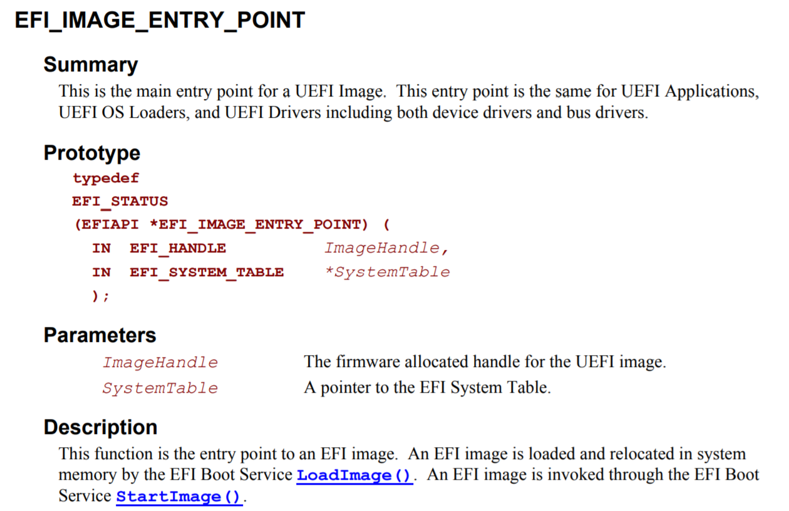
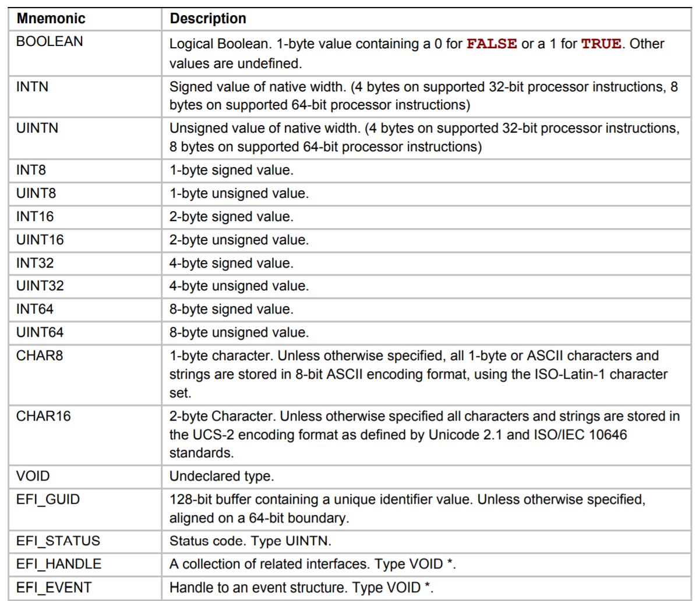
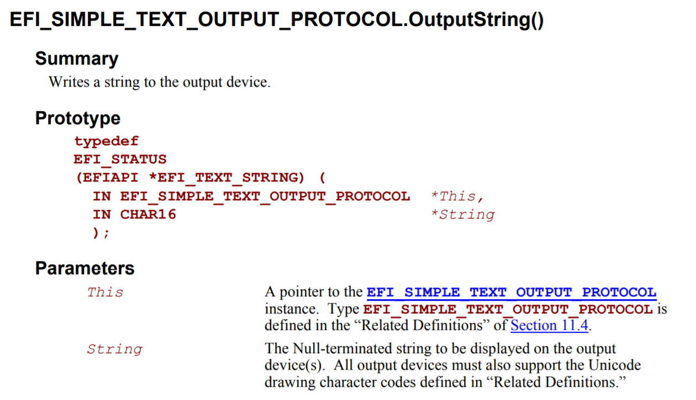
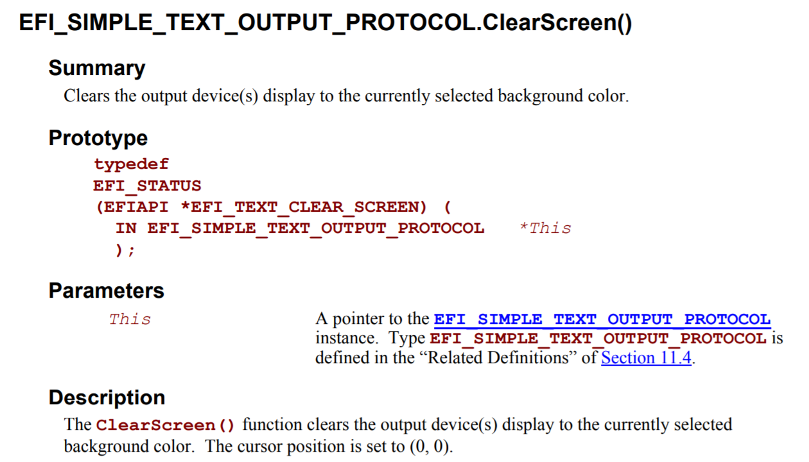

# 遵循UEFI标准编写程序

## 阅读UEFI标准文档的方法

UEFI标准文档可以在 [https://uefi.org/specifications](https://uefi.org/specifications) 找到。本书参照的的是[2.3.1](https://uefi.org/sites/default/files/resources/UEFI_Spec_2_3_1.pdf)版本[^1]。但是，对于本书中所涉及的范围，在不同的UEFI标准版本或是实现下，几乎不存在兼容性问题。

UEFI标准文档包括C代码片段，并且UEFI固件上所运行的程序基本上都是用C语言编写的。例如，在UEFI标准文档"4.1 UEFI Image Entry Point(P.75)"中，定义了UEFI程序的入口点[^2]（图2.1）。



图2.1：标准文档中定义的入口点

图2.1中展示了入口点函数的参数和返回值。由于入口点函数是通过编译期参数指定的，它可以取任何名字。参数和返回值被定义成了特殊的类型，这些类型也可以在标准文档中找到。比如在标准文档中搜索`EFI_STATUS`，我们可以找到"2.3.1 Data Types(P.23)"（图2.2）。



图2.2："2.3.1 Data Types" 中的 "Table 6. Common UEFI Data Types"（节选）

图2.2展示了标准文档中常见类型的定义。在这里，`EFI_STATUS`表示的是状态码，它的类型是`UINTN`。`UINTN`是一个与平台相关的类型，在32位CPU上，它表示32位无符号整数（unsigned int），而在64位CPU上，它表示64位无符号整数（unsigned long long）[^3]。

此外，UEFI标准中还定义了`IN`、`OUT`、`OPTIONAL`、`EFIAPI`等修饰符（Modifier），它们是对函数或参数的说明。在像EDK2或是gnu-efi这些既有的开发环境和工具链中[^4]，它们均被定义为空字符串。

但是在上表中，我们并不能找到"EFI_SYSTEM_TABLE"的定义。这是由于`EFI_SYSTEM_TABLE`是一个结构体的别名，它在另一个章节被定义。通过搜索标准文档，它在"4.3 EFI System Table(P.78)"中被定义，并且它也有一个C语言代码的定义（图2.3）。


图2.3：`EFI_SYSTEM_TABLE`的定义

图2.3展示了结构体中的成员。UEFI标准文档中有一个叫做“协议（Protocol）”的概念。在UEFI中，功能被分为一个个单元，这些单元被称为“协议”，并且它们被定义成以`_PROTOCOL`结尾的结构体。名如`~_PROTOCOL`这样的结构体包含一系列的函数指针，通过这些函数指针可以调用UEFI固件中的内置功能。

图2.3中的`EFI_SIMPLE_TEXT_OUTPUT_PROTOCOL`是用来把字符输出到屏幕上的协议。那么它有哪些成员那？同样地，我们搜索标准文档，可以在"11.4 Simple Text Output Protocol(P.424)"中找到这个结构体的定义（图2.4）。


图2.4：`EFI_SIMPLE_TEXT_OUTPUT_PROTOCOL`的定义

查看图2.4中的"Protocol Interface Structure"，可以看到它有一个叫做"OutputString"的成员，这就是被用于在屏幕上显示文字的函数。图2.4中的"Parameters"是对各个成员的描述，并且"OutputString"拥有一个指向其定义页面的链接（下划线的"OutputString()"处）。OutputString在标准文档中的定义如图2.5所示。



图2.5：`OutputString`函数的定义

它的参数的含义如下：

* `IN EFI_SIMPLE_TEXT_OUTPUT_PROTOCOL *This`: 指向`EFI_SIMPLE_TEXT_OUTPUT_PROTOCOL`自身的指针
* `IN CHAR16 *String`: 指向输出的字符串的指针，UEFI的字符是Unicode编码的（2字节/UCS-2）

返回值类型为`EFI_STATUS`(在AMD64平台上是uint64_t)。这个值表示函数的执行结果。函数如果执行成功，那么返回0，如果产生错误或警告返回非0值。本书中只检查“函数是否返回0”（即函数是否成功执行），对于其他的函数返回值，请参考标准文档"Appendix D Status Codes(P.1873)"中对各个协议返回值的描述。

由于UEFI所有协议中函数的第一个参数均为指向协议自身的指针，并且返回值类型均为`EFI_STATUS`类型。在接下来的章节中这点将作为约定，不再进行说明。

此外，由于部分UEFI固件启动时会在屏幕上显示内容（比如厂商的logo），在这里，我们先进行一次清屏操作，再调用`OutputString`在屏幕上打印字符串。

用于清屏的函数是`EFI_SIMPLE_TEXT_OUTPUT_PROTOCOL`中的`ClearScreen`函数（标准文档"11.4 Simple Text Output Protocol(P.437)"）。虽然不在图2.4中，但它的描述仍然在"Parameters"中。`ClearScreen`的定义如图2.6所示，它的参数只有一个指向协议自身的`This`指针。



图2.6: `ClearScreen`的定义

在接下来的章节中，将会在示例代码中说明函数参数的定义。


## 编写UEFI应用程序

了解了入口点的标准和如何调用函数来向屏幕中打印字符串之后，是时候编写一个hello world程序了。这一章的示例代码在目录`hello`中 (日文版为`sample1_1_hello_uefi`)。

在本书中使用的开发环境为Debian GNU/Linux，这是作者的工作环境。但是，你可以在几乎任何支持交叉编译和格式化U盘（具体将在之后叙述）的环境下开发。当然，任何文本编辑器都可以。

在屏幕上打印"Hello UEFI!"的源代码如代码2.1所示。

```c
struct EFI_SYSTEM_TABLE {
    char _buf[60];
    struct EFI_SIMPLE_TEXT_OUTPUT_PROTOCOL {
        unsigned long long _buf;
        unsigned long long (*OutputString)(
            struct EFI_SIMPLE_TEXT_OUTPUT_PROTOCOL *This,
            unsigned short *String);
        unsigned long long _buf2[4];
        unsigned long long (*ClearScreen)(
             struct EFI_SIMPLE_TEXT_OUTPUT_PROTOCOL *This);
    } *ConOut;
};
  
void efi_main(void *ImageHandle __attribute__ ((unused)),
    struct EFI_SYSTEM_TABLE *SystemTable)
{
    SystemTable->ConOut->ClearScreen(SystemTable->ConOut);
    SystemTable->ConOut->OutputString(SystemTable->ConOut, L"Hello UEFI!\n");
    while (1);
}

```

代码2.1： `sample1_1_hello_uefi/main.c`

代码2.1中的`EFI_SYSTEM_TABLE`仅定义了要使用的函数。我们用一个变量或是数组来占用未使用的函数的位置，来使得要使用的函数的地址正确。

`efi_main`是我们定义的入口点的函数名。在调用`OutputString`函数之前，我们先调用`ClearScreen`函数来清屏。函数末尾是一个无限循环，也就是说，这个函数永远不会返回。

此处，所有像`EFI_STATUS`这样的UEFI类型都被写为`unsigned long long`。这仅仅是作者个人的偏好。这么做会降低程序的可移植性，对于UEFI类型的最佳做法是用typedef来定义它们。

在接下来的内容中，我们假设把代码1.1的内容保存在文件`main.c`中。


[^1]: 由于作者用于测试的实机环境为Lenovo ThinkPad E450，其UEFI固件遵循2.3.1版标准

[^2]: 一般的C语言程序的入口点为main函数

[^3]: 译者注：此处更精确的描述应为32位为`uint32_t`, 64位为`uint64_t`

[^4]: 本书由于采用裸机编程，上述两者并不会被使用，但它们的源代码会作为调用UEFI功能的参考
