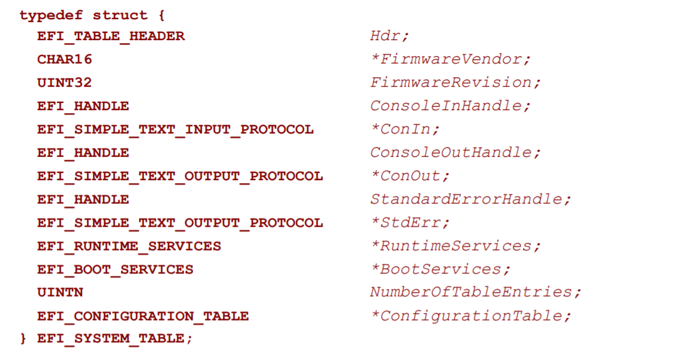

# 简单文本输入协议

获取按键输入的函数位于简单文本输入协议（Simple Text Input Protocol）`EFI_SIMPLE_TEXT_INPUT_PROTOCOL`中。和上一章所介绍的简单文本输出协议`EFI_SIMPLE_TEXT_OUTPUT_PROTOCOL`一样，它也是EFI系统表（System Table）`EFI_SYSTEM_TABLE`的一个成员。



图3.1：`EFI_SYSTEM_TABLE`的定义

`EFI_SIMPLE_TEXT_INPUT_PROTOCOL`的定义如代码3.1所示，这里只定义了我们要使用的函数。关于该结构体的具体定义，参见标准文档"11.3 Simple Text Input Protocol(P.420)"

```c
struct EFI_SIMPLE_TEXT_INPUT_PROTOCOL {
    unsigned long long _buf;
    unsigned long long (*ReadKeyStroke)(
        struct EFI_SIMPLE_TEXT_INPUT_PROTOCOL *This,
        struct EFI_INPUT_KEY *Key);
};
```

代码3.1: `EFI_SIMPLE_TEXT_INPUT_PROTOCOL`的定义

按键输入可以通过`ReadKeyStroke`函数来获取（标准文档"11.3 Simple Text Input Protocol(P.423)"）。该函数是一个非阻塞的函数，当没有按键输入时，它将会返回一个错误的状态。函数的参数如下（省略第一个参数`This`指针）:

* `struct EFI_INPUT_KEY *Key`: 指向按键输入缓冲区的指针

结构体`EFI_INPUT_KEY`的定义如代码3.2所示。

```c
struct EFI_INPUT_KEY {
    unsigned short ScanCode;
    unsigned short UnicodeChar;
};
```

代码3.2: `EFI_INPUT_KEY`的定义

其成员的含义如下：

* `unsigned short ScanCode`: 按键的扫描码（Scan Code），用于表示Unicode范围之外的按键（Esc键、方向键、功能键等）。扫描码的完整列表见标准文档"Table 88(P.410)"。本书接下来的内容中将只会使用Esc键（扫描码为`0x17`）。对于Unicode范围内的按键，其扫描码为0。
* `unsigned short UnicodeChar`: 当输入按键在Unicode范围内时为其所对应的Unicode值，否则为0。
