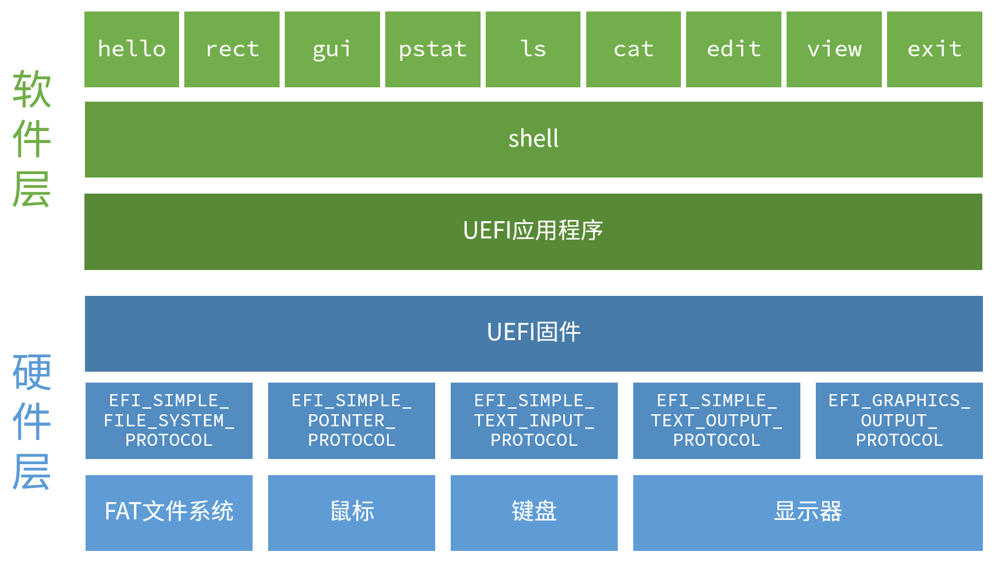

# 引言

感谢您阅读本书！

本书将讨论在UEFI环境下进行“裸机编程”（Bare metal programming）。

“裸机编程”是指编写在不使用操作系统的情况下直接操作硬件的程序的方式。

“直接操作硬件”并非意味着需要编写程序来控制硬件一步一步地发出电信号。许多硬件在其内部的只读存储器（ROM）中拥有预置的软件，称为“固件”。通过正确地调用固件所提供的接口，我们可以达到“直接操作硬件”这一目的。

BIOS是长期以来PC上最具有代表性的固件，而近年来，BIOS已经被标准化的UEFI取代。在打开计算机电源的时候，BIOS或是UEFI固件将会先运行，再从磁盘上引导操作系统。

跟随着近年的趋势，本书将在UEFI上进行裸机编程。因此，本书将主要介绍如何使用UEFI固件内置的功能。

## 关于poiOS

在本书中，我们将通过调用UEFI内置的功能，编写一个类似于操作系统的程序。这里我们称它为poiOS[^1]，其架构如图1所示：

图1：poiOS的构造

## 获取本书相关资源

本书日语原版的相关资源，例如PDF电子版、示例源代码以及预编译的二进制文件，可以在下面的网站找到

* [http://yuma.ohgami.jp](http://yuma.ohgami.jp)

此外，正如上面的网页中所述，示例源代码被发布在下面的Github版本库中。源代码根据各章节被放在不同的目录中，每个目录的开头即为所对应的章节序号。由于篇幅所限，书中仅引用代码片段，如果您想要查看完整的源代码，请点击下面的链接

* [https://github.com/cupnes/c92_uefi_bare_metal_programming_samples](https://github.com/cupnes/c92_uefi_bare_metal_programming_samples)

中文版本的示例代码位于下面的链接

* [https://github.com/kagurazakakotori/ubmp-cn-code](https://github.com/kagurazakakotori/ubmp-cn-code)

[^1]: 译者注：poi为游戏《舰队Collection》中角色“夕立”的口癖

