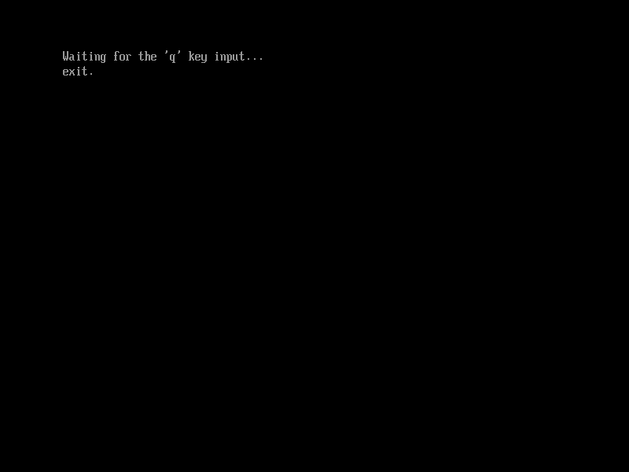

# 绑定按键事件

`RegisterKeyNotify()`是用来将特定按键输入事件和事件处理函数绑定的函数，如图3.2所示.

本节示例代码的目录为`key-notify` (日文版为`020_simple_text_input_ex_register_key_notify`)。

```c
struct EFI_SIMPLE_TEXT_INPUT_EX_PROTOCOL {
    ...
    unsigned long long (*RegisterKeyNotify)(
        struct EFI_SIMPLE_TEXT_INPUT_EX_PROTOCOL *This,
        struct EFI_KEY_DATA *KeyData,
            /* 要绑定的按键事件 */
        unsigned long long (*KeyNotificationFunction)(
            struct EFI_KEY_DATA *KeyData),
            /* 指向要绑定的函数的指针 */
        void **NotifyHandle
            /* 返回的句柄，它的值唯一，在取消绑定时要用到 */
        );
    ...
};
```

图3.2: `RegisterKeyNotify()`相关的定义（位于`efi.h`中）

而这个函数的第二个参数类型`struct EFI_KEY_DATA`如图3.3所示。

```c
struct EFI_KEY_DATA {
    /* 要绑定的按键 */
    struct EFI_INPUT_KEY {
        unsigned short ScanCode;
            /* 扫描码，用于Unicode范围外的按键 */
        unsigned short UnicodeChar;
            /* Unicode码，用于Unicode范围内的按键 */
    } Key;
    /* 要绑定的输入设备状态 */
    struct EFI_KEY_STATE {
        unsigned int KeyShiftState;
            /* Ctrl、Alt、Shift等键的状态（是否按下） */
        unsigned char KeyToggleState;
            /* 切换键状态，如NumLock、CapsLock是否被按下 */
    } KeyState;
};
```

图3.3: `struct EFI_KEY_DATA`的定义

`EFI_KEY_DATA`表示的按键事件不是单纯的某个按键被按下，而是“在某一特定状态下某个按键被按下”，因此它支持组合键。关于这部分更详细的内容，参见标准文档"11.2 Simple Text Input Ex Protocol(P.414)"。接下来的代码中，我们不考虑按下时键盘的状态，也就是说只会用到其中的`EFI_INPUT_KEY`这一部分，所以我们把`EFI_KEY_STATE`中的值都设为0。

图3.4展示了一个使用`RegisterKeyNotify()`的例子。

```c
#include "efi.h"
#include "common.h"

unsigned char is_exit = FALSE;

unsigned long long key_notice(
    struct EFI_KEY_DATA *KeyData __attribute__ ((unused)))
{
    is_exit = TRUE;

    return EFI_SUCCESS;
}

void efi_main(void *ImageHandle __attribute__ ((unused)),
          struct EFI_SYSTEM_TABLE *SystemTable)
{
    unsigned long long status;
    struct EFI_KEY_DATA key_data = {{0, L'q'}, {0, 0}};
    void *notify_handle;

    efi_init(SystemTable);
    ST->ConOut->ClearScreen(ST->ConOut);

    puts(L"Waiting for the 'q' key input...\r\n");

    status = STIEP->RegisterKeyNotify(STIEP, &key_data, key_notice, &notify_handle);
    assert(status, L"RegisterKeyNotify");

    while (!is_exit);

    puts(L"exit.\r\n");

    while (TRUE);
}
```

图3.4: 使用`RegisterKeyNotify()`的例子

上面这段代码实现了按下"q"键来退出`efi_main()`中的一个循环的功能。这里要处理的事件是“按下q键”，因此我们先将`key_data.Key.UnicodeChar`设置为"q"，并将`key_data`中的其它属性设为0。然后，我们使用`RegisterKeyNotify()`函数，将“按下q键”这一事件与事件处理函数`key_notice()`绑定。在`key_notice()`函数中，我们把全局变量`is_exit`设置为`TRUE`，这样就实现了按下q键跳出`efi_main()`中`while (!is_exit);`这个循环的功能，如图3.5和图3.6所示。


图3.5: 图3.4的程序等待q键输入时的情况



图3.6: 按下q键后的情况


### 补充: 获取Unicode范围外的按键输入

对于Unicode范围外的按键输入（Esc键、方向键、功能键等），需要设置`EFI_KEY_DATA.ScanCode`为这个按键对应的扫描码。标准文档"Table 88. EFI Scan Codes for EFI_SIMPLE_TEXT_INPUT_PROTOCOL(P.410)"和"Table 89. EFI Scan Codes for EFI_SIMPLE_TEXT_INPUT_EX_PROTOCOL(P.411)"记录了各个按键对应的扫描码。表3.1是对它们的汇总。

| 扫描码 | 按键      | 扫描码        | 按键      |
| ------ | --------- | ------------- | --------- |
| 0x00   | Null      | 0x15          | F11       |
| 0x01   | ↑         | 0x16          | F12       |
| 0x02   | ↓         | 0x68          | F13       |
| 0x03   | →         | 0x69          | F14       |
| 0x04   | ←         | 0x6A          | F15       |
| 0x05   | Home      | 0x6B          | F16       |
| 0x06   | End       | 0x6C          | F17       |
| 0x07   | Insert    | 0x6D          | F18       |
| 0x08   | Delete    | 0x6E          | F19       |
| 0x09   | Page Up   | 0x6F          | F20       |
| 0x0a   | Page Down | 0x70          | F21       |
| 0x0b   | F1        | 0x71          | F22       |
| 0x0c   | F2        | 0x72          | F23       |
| 0x0d   | F3        | 0x73          | F24       |
| 0x0e   | F4        | 0x7F          | 静音      |
| 0x0f   | F5        | 0x80          | 音量+     |
| 0x10   | F6        | 0x81          | 音量-     |
| 0x11   | F7        | 0x100         | 亮度+     |
| 0x12   | F8        | 0x101         | 亮度-     |
| 0x13   | F9        | 0x102         | 待机      |
| 0x14   | F10       | 0x103         | 休眠      |
| 0x17   | Esc       | 0x104         | 屏幕开关  |
|        |           | 0x105         | 恢复      |
|        |           | 0x106         | 弹出      |
|        |           | 0x8000-0xFFFF | OEM保留键 |

表3.1: 各按键对应的扫描码

查表3.1可知，如果要绑定Esc键，我们需要将`EFI_KEY_DATA.Key.ScanCode`设置为`0x17`。因此，如果要把图3.4中的程序改成“按下Esc键来退出循环”的话，我们只需要像图3.7这样修改第18行的变量`key_data`即可。

```diff
- struct EFI_KEY_DATA key_data = {{0, L'q'}, {0, 0}};
+ struct EFI_KEY_DATA esc_key_data = {{0x17, 0}, {0, 0}};
```

图3.7: 将q键改为Esc键所需要进行的修改
