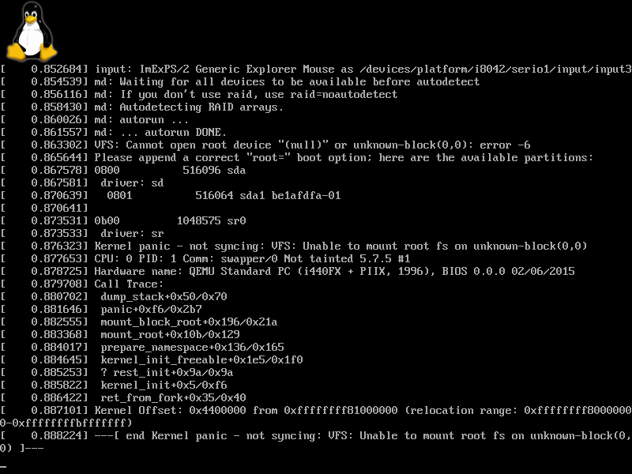

# 启动Linux: 编译并启动内核

自Linux内核3.3版本起，可以在编译时的设置(menuconfig)选择将其编译成UEFI应用程序，这个功能叫做EFI Stub。通过这个功能，我们可以用之前介绍过的运行UEFI应用程序的办法来启动Linux内核镜像(bzImage格式)。

本节示例代码的目录为`boot-kernel` (日文版为`037_start_bzImage`)。


## 环境搭建

这里我们介绍在使用apt包管理器的发行版(Debian、Ubuntu等)下的环境搭建。

通过`apt build-dep <软件包名>`命令，可以一键安装编译某个特定软件包的依赖包。

内核镜像的包名是`linux-image-<版本号>-<类型>`。当前使用的内核版本号和类型可以通过`uname -r`命令来查看。因此，我们可以用下面这条命令来安装编译Linux内核要用到的环境。

```shell
$ sudo apt-get build-dep linux-image-$(uname -r)
```

此外，menuconfig的依赖`libncurses5-dev`在运行`apt-get build-dep`时不会被安装，我们需要手动安装它。

```shell
$ sudo apt install libncurses5-dev
```


## 获取Linux内核源代码

源代码可以通过`apt-get source <软件包名>`来获取，但这里，我们使用[kernel.org](https://kernel.org)上的最新的稳定版Linux内核。点击网页上的"Latest Stable Kernel"，就可以下载了。


图4.32: kernel.org

下载完成后，用下面的命令解压它。

```shell
$ tar -Jxf linux-<版本号>.tar.xz
```

> **译者补充: 从镜像网站下载**
>
> 由于众所周知的原因，直接从kernel.org下载内核源码的速度可能会令人难以忍受。一个解决办法是从国内的镜像站下载。
>
> 清华大学开源软件镜像站: [https://mirrors.tuna.tsinghua.edu.cn/kernel/](https://mirrors.tuna.tsinghua.edu.cn/kernel/)
>
> 中国科学技术大学开源软件镜像站: [https://mirrors.ustc.edu.cn/kernel.org/linux/kernel/](https://mirrors.ustc.edu.cn/kernel.org/linux/kernel/)
>
> 找到Latest Stable Kernel对应的`.tar.xz`文件点击下载即可。


## 配置编译选项

接下来我们配置内核的编译选项。首先进入到解压后的Linux内核源代码的目录，并载入x86_64架构的默认编译选项。

```shell
$ cd linux-<版本号>
$ make x86_64_defconfig
```

接着，打开menuconfig，并启用EFI Stub(选项名为`CONFIG_EFI_STUB`)。

```shell
$ make menuconfig
```


图4.33: menuconfig界面

找到并进入"Processor type and features"，并勾选"EFI stub support"（按"Y"键）。


图4.34: 勾选"EFI stub support"


## 编译内核

现在我们开始编译Linux内核。make命令的`-j`选项指定编译线程数，这里我们用`nproc`命令获得的逻辑CPU数量作为`-j`选项(编译线程数)的值来加快编译速度。

```shell
$ make -j $(nproc)
```

编译Linux内核可能需要比较长的时间，坐和放宽。

编译完成后，我们会在`arch/x86/boot`目录下得到一个名为`bzImage`的镜像文件。


## 启动内核镜像

把`arch/x86/boot/bzImage`复制到之前我们存放`test.efi`的位置，并改名为`bzImage.efi`，再把上一节图4.30代码中的`test.efi`改成`bzImage.efi`并重新编译[^1]，就可以启动Linux内核了，如图4.35所示。



图4.35: 启动时产生的内核错误

虽然这里我们启动了Linux内核，但这里产生了一个内核错误(Kernel panic)，这是因为我们还没有指定根文件系统。下一节将介绍如何指定这些启动参数。


## 补充: 使用menuconfig的搜索功能

如果在menuconfig界面中找不到之前说的选项，我们可以尝试使用它的搜索功能。在menuconfig界面中按下`/`键可以打开搜索界面，如图4.36所示。


图4.36: menuconfig的搜索界面

在搜索框中输入关键词"efi_stub"[^2]，按下Enter键，将会显示这个选项的所在位置和依赖关系，如图4.37所示。这里所有搜索结果的选项名中的`CONFIG_`均被省略。


图4.37: "efi_stub"的搜索结果

这里的Location是这个选项的位置，Prompt是这个选项的名称。

如果我们在Location中找不到Prompt这个选项，那么我们应该留意这个选项的依赖(Depends on)。例如上图表明启用`CONFIG_EFI_STUB`这个选项的前提是要启用`CONFIG_EFI`并禁用`CONFIG_X86_USE_3DNOW`，这里方括号`[]`中的是当前该选项的值。当现在设置的选项的值与某个选项依赖要求的不一致时，该选项将不会在menuconfig界面中显示。因此需要先更改依赖选项的值，再来启用这个选项。


[^1]: 译者注：在中文版示例代码中，请将`bzImage`复制到示例代码目录`linux/kernel`下，Makefile会自动完成后续操作

[^2]: 搜索功能是大小写无关的
