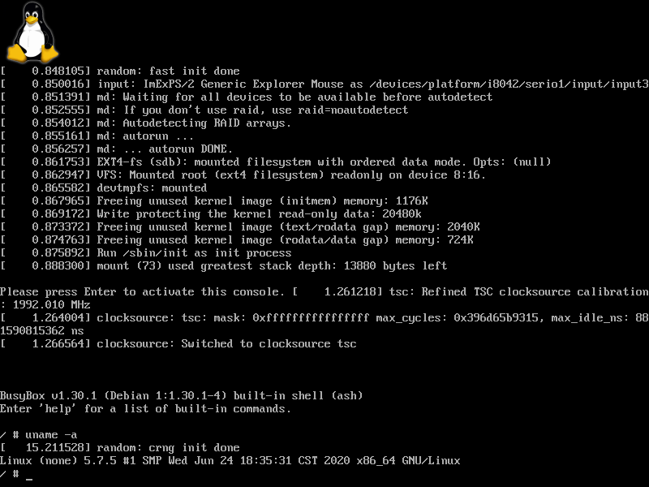

# 启动Linux: 内核启动参数

上一节中，我们启动内核发生了错误，这是由于我们没有指定一些必要的启动参数，例如错误消息中的根文件系统(rootfs)。接下来，我们就来设置这些启动参数。

本节示例代码的目录为`boot-kernel-rootfs` (日文版为`038_start_bzImage_options`)。

UEFI应用程序的参数由`EFI_LOADED_IMAGE_PROTOCOL`中的`LoadOptionsSize`和`LoadOptions`表示，图4.38展示了它们的定义。

```c
struct EFI_LOADED_IMAGE_PROTOCOL {
        unsigned int Revision;
        void *ParentHandle;
        struct EFI_SYSTEM_TABLE *SystemTable;

        /* 镜像源文件的位置 */
        void *DeviceHandle;
        struct EFI_DEVICE_PATH_PROTOCOL *FilePath;
        void *Reserved;

        /* 加载镜像时的选项 */
        unsigned int LoadOptionsSize;  /* 参数字符串的大小 */
        void *LoadOptions;             /* 指向参数字符串的指针 */

        /* 镜像被加载到的位置 */
        void *ImageBase;
        unsigned long long ImageSize;
        enum EFI_MEMORY_TYPE ImageCodeType;
        enum EFI_MEMORY_TYPE ImageDataType;
        unsigned long long (*Unload)(void *ImageHandle);
};
```

图4.38: `EFI_LOADED_IMAGE_PROTOCOL`的定义（位于`efi.h`中，与图4.1相同）

向Linux内核传递启动参数的代码如图4.39所示。

```c
#include "efi.h"
#include "common.h"

void efi_main(void *ImageHandle, struct EFI_SYSTEM_TABLE *SystemTable)
{
    struct EFI_LOADED_IMAGE_PROTOCOL *lip;
    struct EFI_LOADED_IMAGE_PROTOCOL *lip_bzimage;  /* 新增 */
    struct EFI_DEVICE_PATH_PROTOCOL *dev_path;
    struct EFI_DEVICE_PATH_PROTOCOL *dev_node;
    struct EFI_DEVICE_PATH_PROTOCOL *dev_path_merged;
    unsigned long long status;
    void *image;
    unsigned short options[] = L"root=/dev/sdb init=/bin/sh rootwait";  /* 新增 */

    efi_init(SystemTable);
    ST->ConOut->ClearScreen(ST->ConOut);

    /* 获取ImageHandle的EFI_LOADED_IMAGE_PROTOCOL(lip) */
    status = ST->BootServices->OpenProtocol(
        ImageHandle, &lip_guid, (void **)&lip, ImageHandle, NULL,
        EFI_OPEN_PROTOCOL_GET_PROTOCOL);
    assert(status, L"OpenProtocol(lip)");

    /* 获取lip->DeviceHandle的EFI_DEVICE_PATH_PROTOCOL(dev_path) */
    status = ST->BootServices->OpenProtocol(
        lip->DeviceHandle, &dpp_guid, (void **)&dev_path, ImageHandle,
        NULL, EFI_OPEN_PROTOCOL_GET_PROTOCOL);
    assert(status, L"OpenProtocol(dpp)");

    /* 创建bzImage.efi的设备节点 */
    dev_node = DPFTP->ConvertTextToDeviceNode(L"bzImage.efi");

    /* 把dev_node附加到dev_path后 */
    dev_path_merged = DPUP->AppendDeviceNode(dev_path, dev_node);

    /* 把dev_path_merged转换成字符串并显示 */
    puts(L"dev_path_merged: ");
    puts(DPTTP->ConvertDevicePathToText(dev_path_merged, FALSE, FALSE));
    puts(L"\r\n");

    /* 从dev_path_merged加载镜像 */
    status = ST->BootServices->LoadImage(FALSE, ImageHandle,
                         dev_path_merged, NULL, 0, &image);
    assert(status, L"LoadImage");
    puts(L"LoadImage: Success!\r\n");

    /* 新增(此处开始) */
    /* 设置内核启动选项 */
    status = ST->BootServices->OpenProtocol(
        image, &lip_guid, (void **)&lip_bzimage, ImageHandle, NULL,
        EFI_OPEN_PROTOCOL_GET_PROTOCOL);
    assert(status, L"OpenProtocol(lip_bzimage)");
    lip_bzimage->LoadOptions = options;
    lip_bzimage->LoadOptionsSize = (strlen(options) + 1) * sizeof(unsigned short);
    /* 新增(此处结束) */

    /* 启动Linux内核 */
    status = ST->BootServices->StartImage(image, NULL, NULL);
    assert(status, L"StartImage");
    puts(L"StartImage: Success!\r\n");

    while (TRUE);
}
```

图4.39: 向Linux内核传递启动参数

这里，我们的启动参数是`root=/dev/sdb init=/bin/sh rootwait`。[^1]

`root=...`告诉内核使用哪个设备作为根文件系统。这里我们使用`/dev/sdb`，它表示第二个磁盘，并且这个磁盘上没有分区。这里也可以使用`PARTUUID=<分区的UUID>`来指定，这是一种更准确且与设备无关的方式。[^2]

`init=...`告诉内核在启动后执行哪个程序。如果该选项未被设置，将会启动`/sbin/init`。这里我们设置为`/bin/sh`来在启动后直接运行Shell。因此，我们需要把Shell放入根文件系统，具体的将在后面讲述。

`rootwait`告诉内核无限期等待，直到根文件系统出现。对于U盘等设备，设备的发现是异步的，如果在发现USB设备之前挂载根文件系统，则内核会找不到根文件系统，造成启动失败。

关于更多的内核启动参数，请参阅[man 7 bootparam](http://man7.org/linux/man-pages/man7/bootparam.7.html)和[The kernel’s command-line parameters](https://www.kernel.org/doc/html/v4.14/admin-guide/kernel-parameters.html)。

使用这些启动参数，就可以成功启动到Shell了。



图4.40: 成功启动内核并进入Shell


## 补充: 构建最小根文件系统

对于我们这里只需要运行一个Shell的需求，我们可以使用Busybox来构建一个最小根文件系统。Busybox被誉为“嵌入式Linux系统的瑞士军刀”，它集成了一系列的常用命令，并且通过建立以命令来命名的指向busybox的链接，比如`/bin/ls -> /bin/busybox`，可以运行对应的命令。

在使用apt包管理器的发行版(Debian、Ubuntu等)，我们可以通过安装`busybox-static`包来得到静态链接的busybox。

```shell
$ sudo apt install busybox-static
```

安装完成后，我们可以在`/bin/busybox`找到安装的busybox。我们可以把这个文件像下面这样复制到根文件系统下。

```ignore
/
└── bin
    ├── busybox
    └── sh -> busybox
```

尽管Busybox提供了基本的命令，但如果需要使用`apt`这样的命令，构建根文件系统就变得困难起来了。幸好，Debian系操作系统提供了构建最小Debian根文件系统的命令`debootstrap`。更棒的是，这个命令在Ubuntu或是Linux Mint这些Debian派生的发行版上也可以使用。

```shell
$ sudo debootstrap <发行版> <目标目录>
```

如果要在`/mnt/storage`上构建Debian 10 "buster"的最小根文件系统，只需要运行下面这条命令：

```shell
$ sudo debootstrap buster /mnt/storage
```

更多用法请参照`man debootstrap`。


> **构建更完整的Busybox根文件系统**
>
> *本段为译者补充*
>
> 上面所介绍的最小根文件系统存在不少缺陷，例如当执行某些`busybox`中存在的命令时，会提示`applet not found`，并且`proc`文件系统也没有被挂载。在中文版的示例代码中，`mkrootfs.sh`构建了一套更为完整的基于Busybox的根文件系统，解决了这些问题。
>
> Busybox提供了`--list-full`这一选项来列出命令的完整路径，通过这一功能可以方便地创建各个命令指向它的链接。由于Busybox自带一个`/sbin/init`程序，在创建完它的链接之后，内核启动参数中的`init=/bin/sh`这项就没有必要了，这就是为什么示例代码中的内核启动参数是`root=/dev/sdb rootwait`的原因。
>
> Busybox的`/sbin/init`在启动Shell之前会尝试执行位于`/etc/init.d/rcS`的脚本。图4.41展示了使用这一脚本挂载`/proc`和`/sys`的方式。注意，这一脚本需要执行权限才能被init运行。
>
> ```sh
> #!/bin/sh
> mount -t proc proc /proc
> mount -t sysfs sysfs /sys
> ```
>
> 图4.41: 用于挂载`/proc`和`/sys`的`rcS`脚本
>
> 关于构建这一文件系统的更多细节，请阅读示例代码中的`linux/rootfs-busybox/mkrootfs.sh`。


> **使用initramfs**
>
> *本段为译者补充*
>
> 如果你觉得上面构建根文件系统过于复杂，你也可以使用initramfs。使用这一方式的示例代码的目录为`boot-kernel-initramfs`。
>
> initramfs是一个启动时用到的文件系统，内核启动时它会被加载到内存中，内核启动完成后会将控制权交给其中的init。init将会执行其他的用户态程序来进行后续的启动操作，例如加载额外的内核模块（设备驱动等），挂载根文件系统，运行根文件系统的init。许多initramfs的实现都带有一个Shell，用于运行启动脚本和系统无法启动时的救援操作。
> 
> 构建initramfs的方式非常简单，只需要运行下面这条命令即可：
>
> ```shell
> $ mkinitramfs -o initramfs.img
> ```
>
> 这里，我们将`initramfs.img`放在EFI分区的根目录中，使用的启动参数是`root=/dev/sda1 initrd=initramfs.img`。显然，`initrd=...`告诉内核initramfs的位置。另外，由于内核并不支持将VFAT分区挂载为根文件系统，我们将EFI分区所在的`/dev/sda1`设置为rootfs。这样initramfs将无法挂载根文件系统，而这会让我们进入其中的救援Shell，如图4.42所示。
>
> 
>
> 图4.42: initramfs的救援Shell


[^1]: 译者注：原文的启动参数是`root=/dev/sdb2 init=/bin/sh rootwait`，这里为了与中文版示例代码配套进行了修改。

[^2]: 译者注：所有`root=...`可接受的参数形式请参考内核源代码中的[`init/do_mounts.c`](https://github.com/torvalds/linux/blob/master/init/do_mounts.c#L192-L221)
