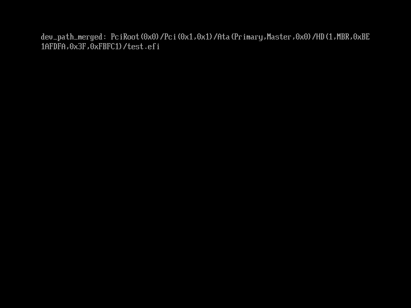

# 创建完整的设备路径

现在，我们有了两个“路径”。一个是`PciRoot`开头的“设备的路径”；另一个是我们之前称作设备路径的`.\test.efi`，它实际上是“文件的路径”。而完整的设备路径，正是它们两者的组合。

本节示例代码的目录为`create-devpath` (日文版为`034_create_devpath_2`)。

`EFI_DEVICE_PATH_UTILITIES_PROTOCOL`这个协议拥有一系列的用来操作路径的函数，这里我们只用到其中的`AppendDeviceNode()`这个函数，图4.22展示了它们的定义。

```c
struct EFI_DEVICE_PATH_UTILITIES_PROTOCOL {
        unsigned long long _buf[3];
        /* 将设备节点附加到设备路径后 */
        struct EFI_DEVICE_PATH_PROTOCOL *(*AppendDeviceNode)(
                const struct EFI_DEVICE_PATH_PROTOCOL *DevicePath,
                        /* 设备路径 */
                const struct EFI_DEVICE_PATH_PROTOCOL *DeviceNode
                        /* 要附加的设备节点 */
                );
};
```

图4.22: `EFI_DEVICE_PATH_UTILITIES_PROTOCOL.AppendDeviceNode()`的定义（位于`efi.h`中）

这里的“设备节点”是设备路径的一部分，指的是以`\`号分隔的一个元素。例如在`\EFI\BOOT\BOOTX64.EFI`中，`EFI`和`BOOT`就是两个设备节点。`AppendDeviceNode()`就是在指定的设备路径后附加一个设备节点的函数[^1]。这里，我们的文件`test.efi`可以看成是设备根节点下的一个设备节点，因而可以直接使用这个函数。

此外，之前用到过的`EFI_DEVICE_PATH_FROM_TEXT_PROTOCOL`中还有一个用来把字符串转换为设备节点的函数`ConvertTextToDeviceNode()`，如图4.23所示。这里我们也会用到它。

```c
struct EFI_DEVICE_PATH_FROM_TEXT_PROTOCOL {
        /* 将字符串转换为设备节点 */
        struct EFI_DEVICE_PATH_PROTOCOL *(*ConvertTextToDeviceNode) (
                const unsigned short *TextDeviceNode
                        /* 要转换为设备节点的字符串 */
                );
        struct EFI_DEVICE_PATH_PROTOCOL *(*ConvertTextToDevicePath) (
                const unsigned short *TextDevicePath);
};
```

图4.23: `ConvertTextToDeviceNode()`的定义（位于`efi.h`中）

接下来，就可以像图4.24这样把设备节点附加到设备路径之后了。

```c
#include "efi.h"
#include "common.h"

void efi_main(void *ImageHandle, struct EFI_SYSTEM_TABLE *SystemTable)
{
    struct EFI_LOADED_IMAGE_PROTOCOL *lip;
    struct EFI_DEVICE_PATH_PROTOCOL *dev_path;
    struct EFI_DEVICE_PATH_PROTOCOL *dev_node;         /* 新增 */
    struct EFI_DEVICE_PATH_PROTOCOL *dev_path_merged;  /* 新增 */
    unsigned long long status;

    efi_init(SystemTable);
    ST->ConOut->ClearScreen(ST->ConOut);

    /* 获取ImageHandle的EFI_LOADED_IMAGE_PROTOCOL(lip) */
    status = ST->BootServices->OpenProtocol(
        ImageHandle, &lip_guid, (void **)&lip, ImageHandle, NULL,
        EFI_OPEN_PROTOCOL_GET_PROTOCOL);
    assert(status, L"OpenProtocol(lip)");

    /* 获取lip->DeviceHandle的EFI_DEVICE_PATH_PROTOCOL(dev_path) */
    status = ST->BootServices->OpenProtocol(
        lip->DeviceHandle, &dpp_guid, (void **)&dev_path, ImageHandle,
        NULL, EFI_OPEN_PROTOCOL_GET_PROTOCOL);
    assert(status, L"OpenProtocol(dpp)");

    /* 新增/修改(此处开始) */
    /* 创建test.efi的设备节点 */
    dev_node = DPFTP->ConvertTextToDeviceNode(L"test.efi");

    /* 把dev_node附加到dev_path后 */
    dev_path_merged = DPUP->AppendDeviceNode(dev_path, dev_node);

    /* 把dev_path_merged转换成字符串并显示 */
    puts(L"dev_path_merged: ");
    puts(DPTTP->ConvertDevicePathToText(dev_path_merged, FALSE, FALSE));
    puts(L"\r\n");
    /* 新增/修改(此处结束) */

    while (TRUE);
}
```

图4.24: 使用`AppendDeviceNode()`的例子

这个程序将会在设备路径后附加`test.efi`，并将得到的设备路径转换成字符串并显示在屏幕上，如图4.25所示。



图4.25: 图4.24程序输出的附加后的设备路径


> **表示设备路径和设备节点的`EFI_DEVICE_PATH_PROTOCOL`**
> 
> 设备路径和设备节点都是`EFI_DEVICE_PATH_PROTOCOL`类型的，换句话说，它既可以表示设备路径，也可以表示设备节点。你可能会好奇这是怎么做到的？让我们先来看一下图4.26中`EFI_DEVICE_PATH_PROTOCOL`的定义。
> 
> ```c
> struct EFI_DEVICE_PATH_PROTOCOL {
>         unsigned char Type;
>         unsigned char SubType;
>         unsigned char Length[2];
> };
> ```
> 
> 图4.26: `EFI_DEVICE_PATH_PROTOCOL`定义（位于`efi.h`中）
> 
> 可以看到，`EFI_DEVICE_PATH_PROTOCOL`结构体中并没有指向其他变量或是结构体的指针，也不构成链表或是树这样的数据结构，它仅仅是内存上一块连续的区域。并且，它也没有用于存放诸如文件名之类的对于一个文件的路径来说是必要的信息的元素。
> 
> 事实上，`EFI_DEVICE_PATH_PROTOCOL`只是各种设备节点的头部，而主体部分则在它后面的内存中。因此，它只有表示设备节点类型的成员`Type`、`SubType`，以及表示包括头部的大小的成员`Length`。
> 
> 对于设备路径，它也没有用来表示其中节点数的成员。设备节点的结尾是通过一个特殊的设备节点来表示的。可以看作是一个隐式链表。
> 
> UEFI提供了一系列的抽象，例如`EFI_DEVICE_PATH_FROM_TEXT_PROTOCOL`和`EFI_DEVICE_PATH_UTILITIES_PROTOCOL`。因此，我们无需了解设备路径的细节、节点的结构或是内存分配，也可以获取到相应的信息。在我们之前用`AppendDeviceNode()`在设备路径后附加节点的时候，类似于结尾节点这样的信息会被固件自动安排妥当。因此，我们没有必要去纠结于UEFI固件上的细节。


[^1]: `EFI_DEVICE_PATH_UTILITIES_PROTOCOL`中还有用来拼接两个设备路径的函数等等一系列函数，由于这里我们没有用到它们，因此不作介绍。
