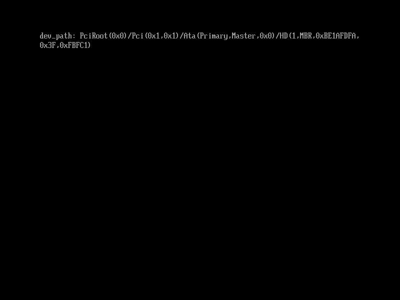

# 设备路径的“设备”

到现在，我们已经知道了如何查看、创建形如`\EFI\BOOT\BOOTX64.EFI`或是`\test.efi`这样的设备路径。但你有没有这样一个疑问，既然我们称它们为设备路径，“设备”表现在哪里？这个路径并不能表示文件是在哪个设备上的。比如说，我们无法通过这些路径区分文件是在硬盘上的还是U盘上的。

UEFI是用路径的形式来表示设备的，这也是为什么称它为“设备路径”。之前的我们创建的“设备路径”只有“路径”，缺少了“设备”这一要素。

要知道如何指定“设备”这一部分，我们先来看一下开机自动运行的UEFI应用程序是在哪个设备上的。要获取设备的路径表示，我们仍旧需要用到图4.18中的`EFI_LOADED_IMAGE_PROTOCOL`

本节示例代码的目录为`devicehandle` (日文版为`033_loaded_image_protocol_device_handle`)。

```c
struct EFI_LOADED_IMAGE_PROTOCOL {
        unsigned int Revision;
        void *ParentHandle;
        struct EFI_SYSTEM_TABLE *SystemTable;

        /* 镜像源文件的位置 */
        void *DeviceHandle;
        struct EFI_DEVICE_PATH_PROTOCOL *FilePath;
        void *Reserved;

        /* 加载镜像时的选项 */
        unsigned int LoadOptionsSize;
        void *LoadOptions;

        /* 镜像被加载到的位置 */
        void *ImageBase;
        unsigned long long ImageSize;
        enum EFI_MEMORY_TYPE ImageCodeType;
        enum EFI_MEMORY_TYPE ImageDataType;
        unsigned long long (*Unload)(void *ImageHandle);
};
```

图4.18: `EFI_LOADED_IMAGE_PROTOCOL`的定义（位于`efi.h`中，与图4.1相同）

“镜像源文件的位置”这条注释这边，除了之前用到的`FilePath`，还有一项`DeviceHandle`，通过这项可以得到设备的路径。

要获取设备的路径，需要在`DeviceHandle`上调用`OpenProtocol()`函数来打开`EFI_DEVICE_PATH_PROTOCOL`的接口。如图4.19所示，这一过程很像[4.1 查看当前设备路径](./filepath.md)中调用`OpenProtocol()`来获取`EFI_LOADED_IMAGE_PROTOCOL`，除了我们打开的对象，也就是第一个参数，变成了`DeviceHandle`。

```c
#include "efi.h"
#include "common.h"

void efi_main(void *ImageHandle, struct EFI_SYSTEM_TABLE *SystemTable)
{
    struct EFI_LOADED_IMAGE_PROTOCOL *lip;
    struct EFI_DEVICE_PATH_PROTOCOL *dev_path;
    unsigned long long status;

    efi_init(SystemTable);
    ST->ConOut->ClearScreen(ST->ConOut);

    /* 获取ImageHandle的EFI_LOADED_IMAGE_PROTOCOL(lip) */
    status = ST->BootServices->OpenProtocol(
        ImageHandle, &lip_guid, (void **)&lip, ImageHandle, NULL,
        EFI_OPEN_PROTOCOL_GET_PROTOCOL);
    assert(status, L"OpenProtocol(lip)");

    /* 获取lip->DeviceHandle的EFI_DEVICE_PATH_PROTOCOL(dev_path) */
    status = ST->BootServices->OpenProtocol(
        lip->DeviceHandle, &dpp_guid, (void **)&dev_path, ImageHandle,
        NULL, EFI_OPEN_PROTOCOL_GET_PROTOCOL);
    assert(status, L"OpenProtocol(dpp)");

    /* 把dev_path转换成字符串并显示 */
    puts(L"dev_path: ");
    puts(DPTTP->ConvertDevicePathToText(dev_path, FALSE, FALSE));
    puts(L"\r\n");

    while (TRUE);
}
```

图4.19: 通过`DeviceHandle`获取设备的路径并显示的例子

在编译上面的代码之前，我们还需要加入`EFI_DEVICE_PATH_PROTOCOL`的GUID的定义`dpp_guid`，如图4.20所示

```c
struct EFI_GUID dpp_guid = {0x09576e91, 0x6d3f, 0x11d2,
                            {0x8e, 0x39, 0x00, 0xa0, 0xc9, 0x69, 0x72, 0x3b}};
```

图4.20: `dpp_guid`的定义（位于`efi.h`中）

运行这个程序，我们可以看到图4.21这样的结果。



图4.21: 图4.20程序输出的设备的路径

`PciRoot`开头的字符串就是设备的路径，它也很像我们平时常说的路径。为什么要这么表示超出了本书的范围，因此这边不做解释。我们只需要了解，在UEFI中，几乎所有的设备都有这样的路径，包括存储设备、鼠标等等。
