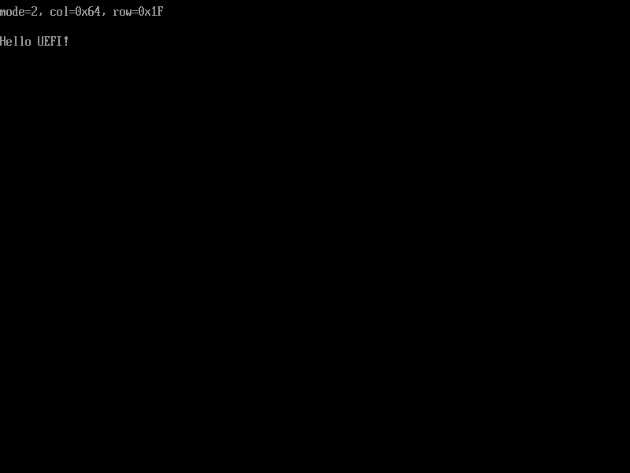

# 设置文本显示模式

要更改文本显示模式(Text mode)，也就是显示的行数和列数，则需要用到`SetMode()`这个函数，图2.12展示了它的定义。

本节示例代码的目录为`set-text-mode` (日文版为`013_simple_text_output_set_mode`)。

```c
struct EFI_SIMPLE_TEXT_OUTPUT_PROTOCOL {
    ...
    unsigned long long (*SetMode)(
        struct EFI_SIMPLE_TEXT_OUTPUT_PROTOCOL *This,
        unsigned long long ModeNumber  /* 要设置的文本显示模式的ID */
        );
    ...
};
```

图2.12: `SetMode()`的定义（位于`efi.h`中）

图2.13展示了一个使用`SetMode()`的例子。[^1]

```c
#include "efi.h"
#include "common.h"

void efi_main(void *ImageHandle __attribute__ ((unused)), struct EFI_SYSTEM_TABLE *SystemTable)
{
    int mode;
    unsigned long long status;
    unsigned long long col, row;

    efi_init(SystemTable);
    ST->ConOut->ClearScreen(ST->ConOut);

    while (TRUE) {
        for (mode = 0; mode < ST->ConOut->Mode->MaxMode; mode++) {
            status = ST->ConOut->QueryMode(ST->ConOut, mode, &col,
                               &row);
            if (status)
                continue;

            ST->ConOut->SetMode(ST->ConOut, mode);
            ST->ConOut->ClearScreen(SystemTable->ConOut);

            puts(L"mode=");
            puth(mode, 1);
            puts(L", col=0x");
            puth(col, 2);
            puts(L", row=0x");
            puth(row, 2);
            puts(L"\r\n");
            puts(L"\r\n");
            puts(L"Hello UEFI!");

            getc();
        }
    }
}
```

图2.13: 使用`SetMode()`的例子

上面的代码按顺序依次切换设备支持的文本显示模式，显示该模式的信息，并显示一行文字“Hello UEFI!こんにちは、世界！”。之后，它调用`getc()`函数来等待用户按下任意键来切换到下一个文本显示模式，如此循环往复。

运行的情况如图2.14和图2.15所示。请试着在自己的电脑上运行这段代码来感受改变文本显示模式带来的变化。


图2.13: 在OVMF的文本显示模式0: 80x25下运行图2.12的程序的情况



图2.14: 在OVMF的文本显示模式2: 100x31下运行图2.12的程序的情况


> **获取和设置图形显示模式**
> 
> `EFI_GRAPHICS_OUTPUT_PROTOCOL`也拥类似的`QueryMode()`和`SetMode()`函数。因此，图形显示模式（分辨率、像素格式等）可以通过`QueryMode()`来获取，并通过`SetMode()`来设置。
> 
> 图2.15展示了`EFI_GRAPHICS_OUTPUT_PROTOCOL`的`QueryMode()`和`SetMode()`的定义。
> 
> ```c
> #define EFI_SUCCESS            0
> #define EFI_ERROR              0x8000000000000000
> #define EFI_INVALID_PARAMETER  (EFI_ERROR | 2)
> 
> struct EFI_GRAPHICS_OUTPUT_PROTOCOL {
>     unsigned long long (*QueryMode)(
>         struct EFI_GRAPHICS_OUTPUT_PROTOCOL *This,
>         unsigned int ModeNumber,         /* 要查询的图形显示模式的ID */
>         unsigned long long *SizeOfInfo,  /* 指向存放Info大小的变量的指针 */
>         struct EFI_GRAPHICS_OUTPUT_MODE_INFORMATION **Info  
>             /* 指向存放得到的图形显示模式信息的结构体的指针 */
>         );
> 
>     unsigned long long (*SetMode)(
>         struct EFI_GRAPHICS_OUTPUT_PROTOCOL *This,
>         unsigned int ModeNumber  /* 要设置的图形显示模式的ID */
>         );
>     ...
> };
> ```
> 
> 图2.15: `QueryMode()`和`SetMode()`的定义
> 
> 不过，当`QueryMode()`的第二个参数`ModeNumber`的值是一个无效的图形显示模式ID时，这个函数的返回值是`EFI_INVALID_PARAMETER`，而不是`EFI_UNSUPPORTED`。
> 
> 类似的，要获取设备支持的图形显示模式的区间，需要用到`EFI_GRAPHICS_OUTPUT_PROTCOL->Mode->MaxMode`这个值。关于更详细的内容，以及结构体`EFI_GRAPHICS_OUTPUT_MODE_INFORMATION`的定义，有兴趣的读者可以阅读标准文档"11.9 Graphics Output Protocol(P.464)"。


[^1]: 译者注：日文版中这个例子输出的内容是"Hello UEFI!こんにちは、せかい!"，考虑到大部分计算机的UEFI固件和OVMF都不支持显示日语字符，这里改成了"Hello UEFI!"。
