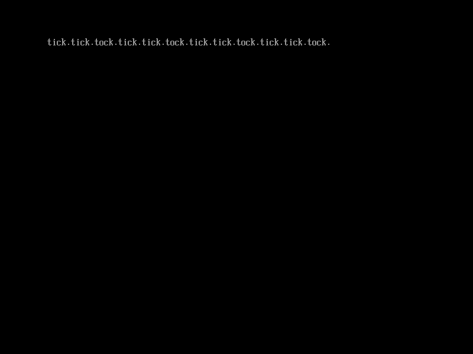

# 利用事件处理函数异步操作

在`CreateEvent()`函数中我们也可以设置事件处理函数来在事件发生时执行某个特定的函数，利用这个功能，我们可以实现异步操作[^1]。

本节示例代码的目录为`timer-notify` (日文版为`041_evt_timer_nonblocking`)。

```c
unsigned long long (*CreateEvent)(
    unsigned int Type,
        /* 事件的类型 */
    unsigned long long NotifyTpl,
        /* 事件的优先级 */
    void (*NotifyFunction)(void *Event, void *Context),
        /* 事件处理函数 */
    void *NotifyContext,
        /* 传递给事件处理函数的参数 */
    void *Event
        /* 创建的事件 */
    );
```

图5.4: `CreateEvent()`的定义（位于`efi.h`中）

图5.4是上一节提到过的`CreateEvent()`的定义。要使用事件处理函数，我们在调用该函数创建计时器事件时，需要把`Type`中的`EVT_TIMER`或上`EVT_NOTIFY_WAIT`或者`EVT_NOTIFY_SIGNAL`。如果或上`EVT_NOTIFY_WAIT`，则表示在调用`WaitForEvent()`或`CheckEvent()`函数等待该事件时，把事件处理函数将放到任务队列中。而如果或上`EVT_NOTIFY_SIGNAL`，则表示在事件被触发时，无论它是如何触发的，都把事件处理函数放到任务队列中。

由于事件处理函数的优先级需要高于UEFI应用程序，因此`NotifyTpl`应该设置为`TPL_CALLBACK`或`TPL_NOTIFY`。

利用事件处理函数来实现上一节中图5.2的程序，我们可以像图5.5这么写。

```c
#include "efi.h"
#include "common.h"

void timer_callback(void *event __attribute__ ((unused)),
                    void *context __attribute__ ((unused)))
{
    puts(L"wait.");
}

void efi_main(void *ImageHandle __attribute__ ((unused)),
              struct EFI_SYSTEM_TABLE *SystemTable)
{
    unsigned long long status;
    void *tevent;

    efi_init(SystemTable);
    ST->ConOut->ClearScreen(ST->ConOut);

    /* 创建计时器事件tevent */
    status = ST->BootServices->CreateEvent(EVT_TIMER | EVT_NOTIFY_SIGNAL,
                                           TPL_CALLBACK, timer_callback,
                                           NULL, &tevent);
    assert(status, L"CreateEvent");

    /* 设置每隔1秒触发tevent事件 */
    status = ST->BootServices->SetTimer(tevent, TimerPeriodic, 10000000);
    assert(status, L"SetTimer");

    while (TRUE);
}
```

图5.5: 使用事件处理函数在屏幕上每隔1秒输出"wait."

这里使用了`TimerPeriodic`类型的计时器来以1秒为周期触发`tevent`事件，并使用事件处理函数`timer_callback()`来输出"wait."。这段代码实现了和上一章一样的效果，如图5.6所示。


图5.6: 图5.5程序的运行结果


*以下内容为译者补充*

利用事件处理函数的特点是这个处理是非阻塞的，而上一节的做法是阻塞的。上一节中，在调用`WaitForEvent()`函数和输出"wait."中间的这段时间里，程序是暂停的。而图5.5的代码在调用`SetTimer()`函数后，程序会继续执行下去，但是控制会每隔1秒传递给事件处理函数，实现了异步操作。

图5.5的代码可能看不出它们的区别，下面图5.7这段代码展示了这一区别。

```c
#include "efi.h"
#include "common.h"

void tick_callback(void *event __attribute__((unused)), void *context __attribute__((unused)))
{
    puts(L"tick.");
}

void efi_main(void *ImageHandle __attribute__((unused)), struct EFI_SYSTEM_TABLE *SystemTable)
{
    unsigned long long status;
    void *tickevent, *tockevent;
    void *wait_list[1];
    unsigned long long idx;

    efi_init(SystemTable);
    ST->ConOut->ClearScreen(ST->ConOut);

    /* 创建计时器事件tickevent, tockevent */
    status = ST->BootServices->CreateEvent(EVT_TIMER | EVT_NOTIFY_SIGNAL, TPL_CALLBACK, tick_callback, NULL, &tickevent);
    assert(status, L"CreateEvent");
    status = ST->BootServices->CreateEvent(EVT_TIMER, 0, NULL, NULL, &tockevent);
    assert(status, L"CreateEvent");

    /* 设置每隔1秒触发tickevent事件 */
    status = ST->BootServices->SetTimer(tickevent, TimerPeriodic, 10000000);
    assert(status, L"SetTimer");

    /* 为WaitForEvent()创建要等待的事件数组 */
    wait_list[0] = tockevent;

    while (TRUE) {
        /* 设置2秒后触发tevent事件 */
        status = ST->BootServices->SetTimer(tockevent, TimerRelative, 20000000);
        assert(status, L"SetTimer");

        /* 等待tevent发生 */
        status = ST->BootServices->WaitForEvent(1, wait_list, &idx);
        assert(status, L"WaitForEvent");

        /* 在屏幕上输出"tock." */
        puts(L"tock.");
    }
}
```

图5.7: 使用两种计时器事件来输出"tick."和"tock."

这段代码结合了上一节和这一节的内容。事件`tickevent`是非阻塞的，它以1秒为周期被触发，并且通过事件处理函数`tick_callback()`来输出"tick."。而事件`tockevent`是阻塞的，我们让它每隔2秒被触发一次，并且等待它触发后输出"tock."。运行这个程序，我们可以看到图5.8这样两个tick一个tock交替输出。



图5.8: 图5.5程序的运行结果

对于事件`tickevent`的处理是独立于`main`函数的，程序的控制流每隔1秒从`main`函数被移交到`tick_callback`函数。程序不会等待事件`tickevent`的发生，它继续执行其他的操作，直到事件发生，控制才被移交给事件处理函数。而`main`函数在`WaitForEvent(tockevent)`返回前，不执行任何操作。换句话说，对`tickevent`的处理是异步非阻塞的，而对`tockevent`的处理则是同步阻塞的，这就是上一节中等待事件发生和这一节注册事件处理函数最本质的区别。


[^1] 译者注: 这一节原作者的理解有误，译者进行了大幅修改
