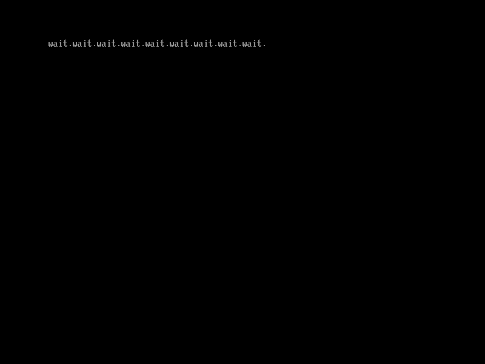

# 暂停程序执行

通过`EFI_BOOT_SERVICES`中的`CreateEvent()`、`SetTimer()`和`WaitForEvent()`这三个函数，可以实现使程序暂停一段时间后再执行的功能。图6.1展示了它们的定义。在第一部分[3.2 编写一个回显程序](../../part1/input/echo.md)中，我们已经介绍并使用过了`WaitForEvent()`这个函数，这里我们将着重介绍另外两个函数。

本节示例代码的目录为`timer-wait` (日文版为`040_evt_timer_blocking`)。

```c
/* 事件类型 */
#define EVT_TIMER                          0x80000000
#define EVT_RUNTIME                        0x40000000
#define EVT_NOTIFY_WAIT                    0x00000100
#define EVT_NOTIFY_SIGNAL                  0x00000200
#define EVT_SIGNAL_EXIT_BOOT_SERVICES      0x00000201
#define EVT_SIGNAL_VIRTUAL_ADDRESS_CHANGE  0x60000202

/* 事件优先级 */
#define TPL_APPLICATION  4
#define TPL_CALLBACK     8
#define TPL_NOTIFY       16

/* 计时器类型 */
enum EFI_TIMER_DELAY {
    TimerCancel,    /* 取消先前设置的计时器 */
    TimerPeriodic,  /* 以指定的时间为周期触发事件 */
    TimerRelative   /* 在指定的时间后触发一次事件 */
};

struct EFI_SYSTEM_TABLE {
    ...
    struct EFI_BOOT_SERVICES {
        ...
        // Event & Timer Services
        /* 创建事件 */
        unsigned long long (*CreateEvent)(
            unsigned int Type,
                /* 事件的类型,
                 * 这里是EVT_TIMER */
            unsigned long long NotifyTpl,
                /* 事件的优先级
                 * 这里使用优先级最低的TPL_APPLICATION */
            void (*NotifyFunction)(void *Event, void *Context),
                /* 事件发生时要执行的处理函数
                 * 这里由于不使用事件处理函数，将其设为NULL*/
            void *NotifyContext,
                /* 传递给事件处理函数的参数
                 * 这里由于不使用事件处理函数，将其设为NULL */
            void *Event
                /* 创建的事件 */
            );
        /* 设置触发事件的计时器 */
        unsigned long long (*SetTimer)(
            void *Event,
                /* 计时器要触发的事件
                 * 这里是我们使用CreateEvent()创建的事件 */
            enum EFI_TIMER_DELAY Type,
                /* 计时器类型
                 * 这里使用TimerRelative */
            unsigned long long TriggerTime
                /* 以100ns为单位的触发事件
                 * 如果这个值为0, 则取决于计时器类型
                 * 如果类型为TimerPeriodic, 则每个tick触发一次事件
                 * 如果类型为TimerRelative, 则在下一个tick触发事件
                 * 这里将其设置为1秒(10000000) */
            );
        /* 等待特定事件发生 */
        unsigned long long (*WaitForEvent)(
            unsigned long long NumberOfEvents,
                /* 要等待的事件数 */
            void **Event,
                /* 存放要等待的事件的数组 */
            unsigned long long *Index
                /* 发生的事件在事件数组中的索引值 */
            );
        ...
    } *BootServices;
};
```

图6.1: `CreateEvent()`、`SetTimer()`、`WaitForEvent()`的定义和它们的相关定义（位于`efi.h`中）

`TriggerTime`中提到的tick是硬件计时器的计数器变化一次的时间，这个叫法的来源是时钟的滴答声(tick-tock)。它的值是硬件计时器频率的倒数，例如10MHz的硬件计时器的一个tick是100ns。

图6.2展示了使用上面这些函数实现使程序暂停1秒后再执行的代码。

```c
#include "efi.h"
#include "common.h"

void efi_main(void *ImageHandle __attribute__ ((unused)),
          struct EFI_SYSTEM_TABLE *SystemTable)
{
    unsigned long long status;
    void *tevent;
    void *wait_list[1];
    unsigned long long idx;

    efi_init(SystemTable);
    ST->ConOut->ClearScreen(ST->ConOut);

    /* 创建计时器事件tevent */
    status = ST->BootServices->CreateEvent(EVT_TIMER, 0, NULL, NULL, &tevent);
    assert(status, L"CreateEvent");

    /* 为WaitForEvent()创建要等待的事件数组 */
    wait_list[0] = tevent;

    while (TRUE) {
        /* 设置1秒后触发tevent事件 */
        status = ST->BootServices->SetTimer(tevent, TimerRelative, 10000000);
        assert(status, L"SetTimer");

        /* 等待tevent发生 */
        status = ST->BootServices->WaitForEvent(1, wait_list, &idx);
        assert(status, L"WaitForEvent");

        /* 在屏幕上输出"wait." */
        puts(L"wait.");
    }
}
```

图6.2: 使用`CreateEvent()`、`SetTimer()`和`WaitForEvent()`的例子

这段代码实现的功能相当于`sleep(1s)`。它用`SetTimer()`函数设置多久之后触发事件，再用`WaitForEvent()`等待事件发生，并通过循环来在屏幕上每隔1秒输出
"wait."，就像图6.3这样。



图6.3: 图6.2程序的运行结果
